<p align="center">
  
</p>

<p align="center">
  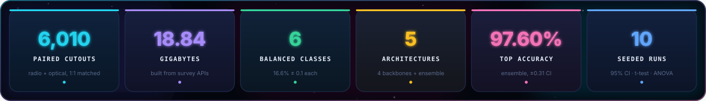
</p>

<p align="center">
  <a href="#-why-this-problem-is-genuinely-hard"></a>
  <a href="#-the-dataset--built-from-scratch"></a>
  <a href="#-architecture-zoo"></a>
  <a href="#-benchmark-results"></a>
  <a href="#-quickstart"></a>
  <a href="#-limitations--honest-notes"></a>
</p>

---

## 🎯 Why this problem is genuinely hard

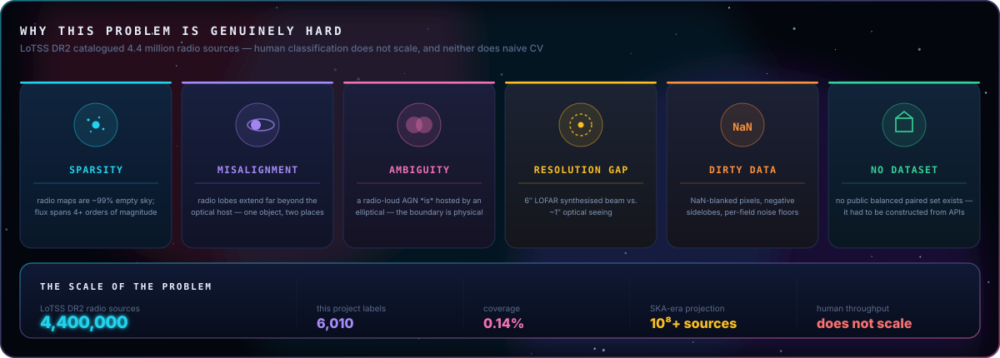

> **Can a network tell what kind of galaxy it is looking at, when the only evidence is a faint smudge of synchrotron emission and a blurry optical postage stamp?**
>
> LoTSS DR2 alone catalogued **4.4 million radio sources**. Human classification does not scale — and neither does naive computer vision, because the object of interest is spread across two instruments, two resolutions and two completely different intensity regimes.

---

## 🛰️ The dataset — built from scratch

There is no `torchvision.datasets.LoTSS`. So the dataset is **constructed**, end to end, from raw survey APIs.

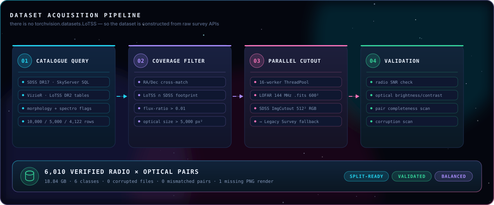

Implemented with **16-worker `ThreadPoolExecutor` concurrency**, per-service fallback (SDSS → Legacy Survey), retry logic and on-the-fly validation.
→ `beautiful_downloader_v2.py` · `beautiful_downloader_multiple.py` · `boost_elliptical.py`

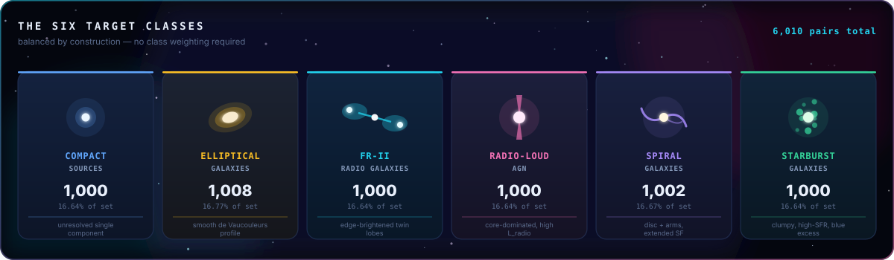

<table>
<tr><td width="55%" valign="top">

### 🧪 Integrity report

```
╔════════════════════════════════════════════════╗
║  VALIDATION            ml_analysis_results/    ║
╠════════════════════════════════════════════════╣
║  Pairs validated ................. 6,010       ║
║  Corrupted optical ...............     0  ✅   ║
║  Corrupted radio FITS ............     0  ✅   ║
║  Mismatched / unpaired ...........     0  ✅   ║
║  Missing PNG renders .............     1       ║
║  Class imbalance (max − min) ..... 0.13 pp ✅  ║
╚════════════════════════════════════════════════╝
```

</td><td width="45%" valign="top">

### 📐 Recommended splits

| Split | Pairs | Share |
|---|--:|--:|
| Train | 4,206 | 70 % |
| Validation | 901 | 15 % |
| Test | 903 | 15 % |

<sub>Stratified by class. Full reports:
[`summary_report.txt`](analysis_results/summary_report.txt) ·
[`ml_analysis_report.txt`](ml_analysis_results/ml_analysis_report.txt) ·
[`validation_report.json`](ml_analysis_results/validation_report.json)</sub>

</td></tr>
</table>

<details>
<summary><b>🖼️ Real samples from the dataset</b> — click to expand</summary>
<br>
<p align="center">
  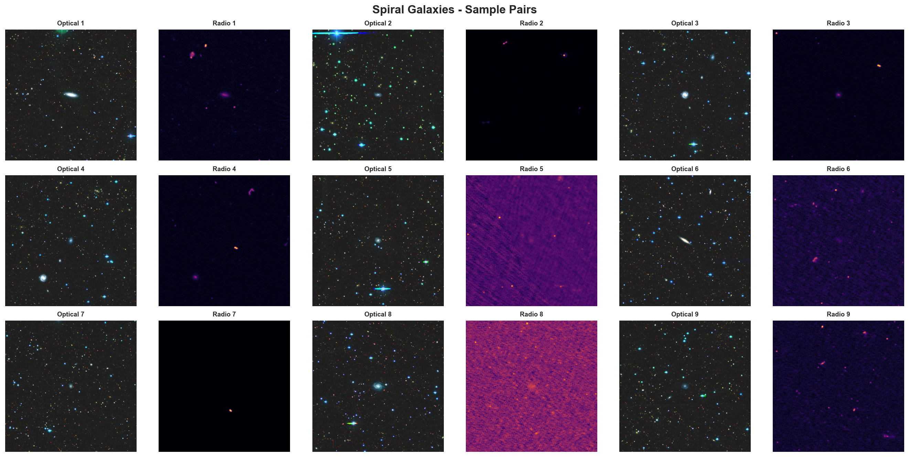
  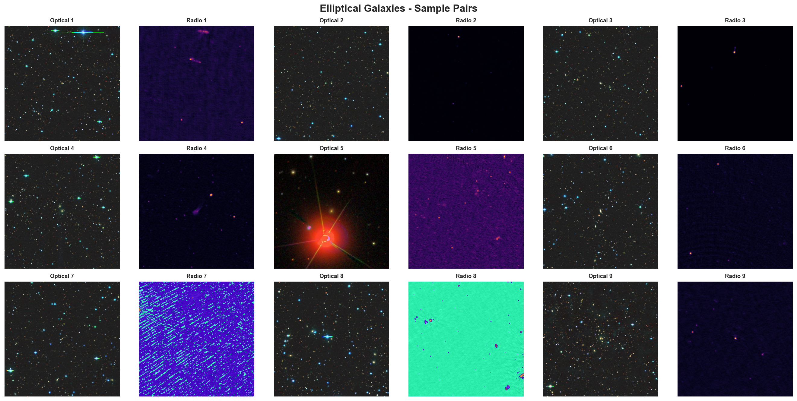
  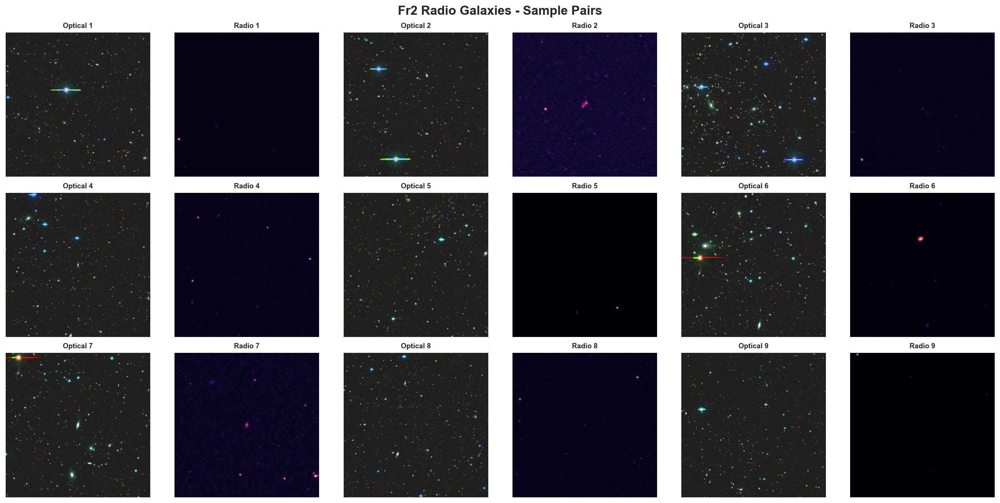<br>
  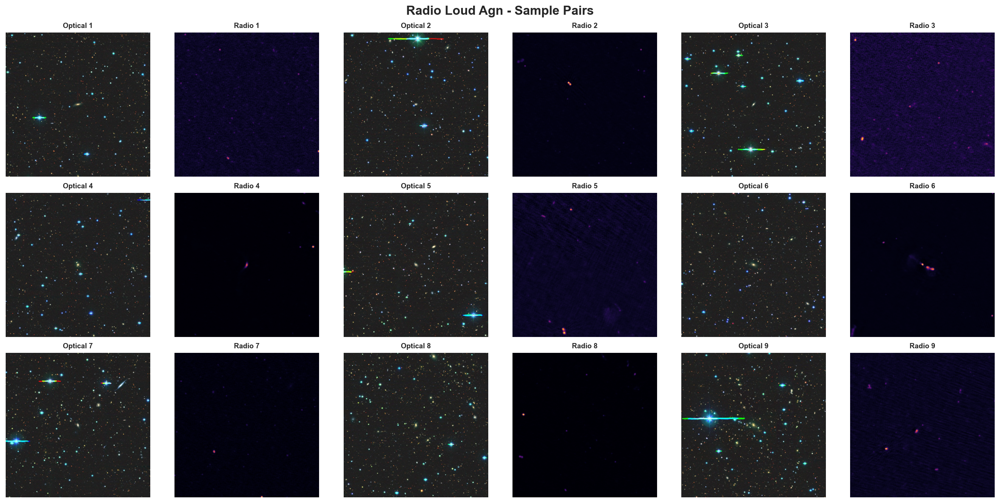
  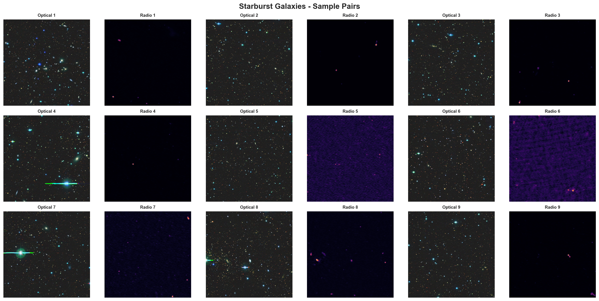
  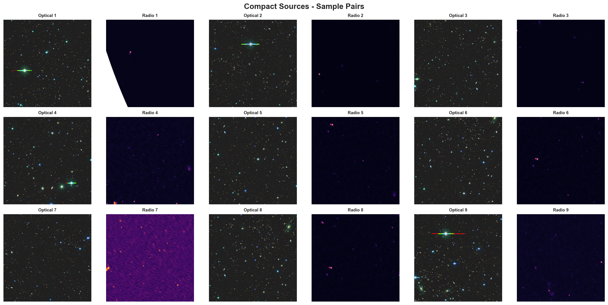
</p>
<p align="center"><i>Spiral · Elliptical · FR-II &nbsp;|&nbsp; Radio-Loud AGN · Starburst · Compact</i></p>
<p align="center">
  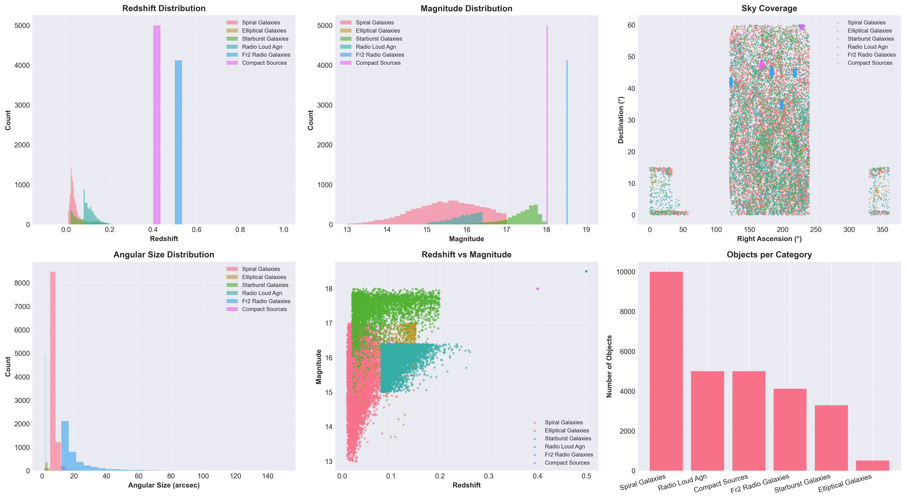<br>
  <sub>Redshift, magnitude and sky-coverage distributions of the source catalogue</sub>
</p>
<p align="center">
  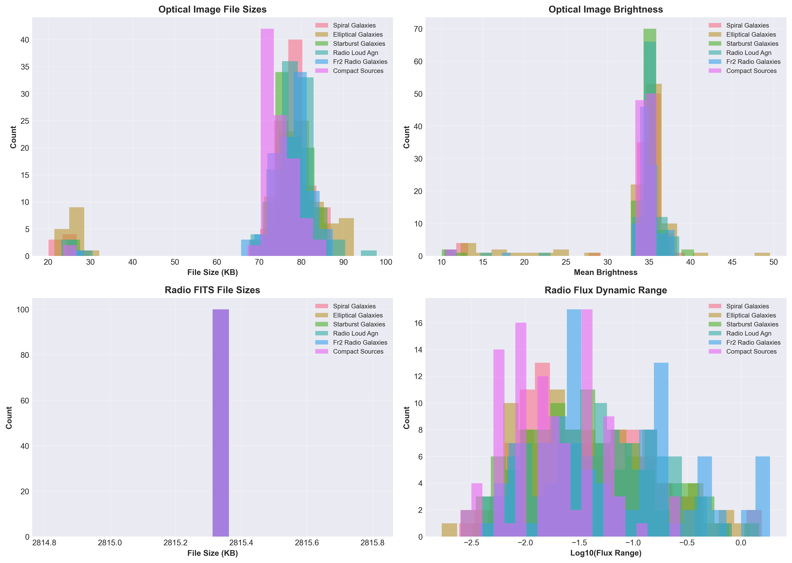
  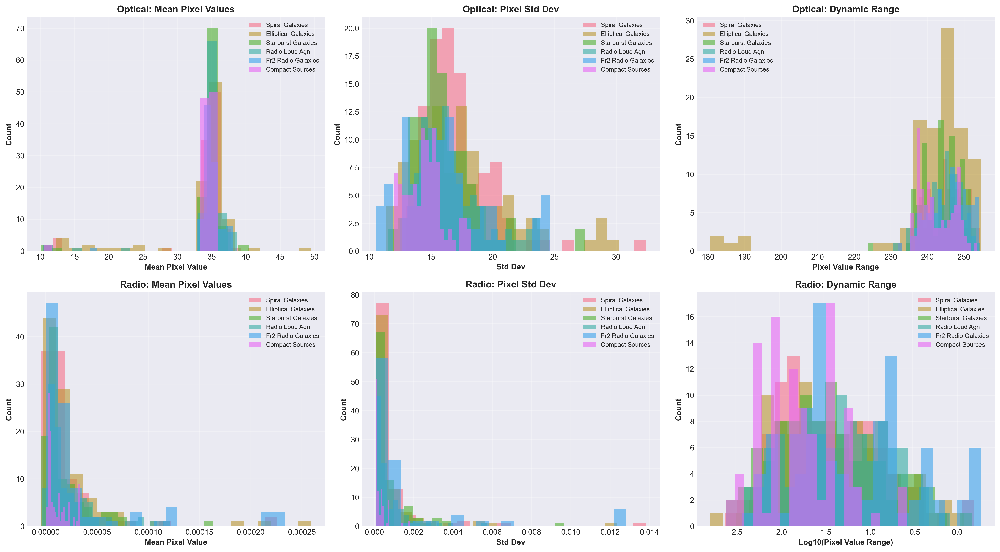
</p>
</details>

---

## ⚗️ Multimodal preprocessing

The single most important design decision in this project: **radio and optical are different physical measurements and must never share a normalisation.**

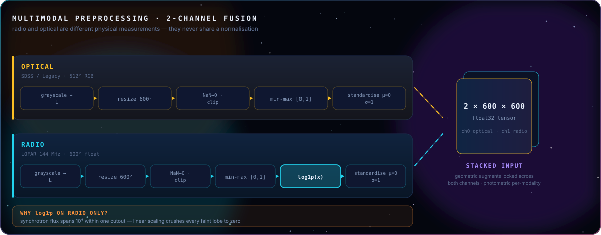

### 🔄 Physics-aware augmentation

Geometric transforms are **locked across both channels** so the pair stays registered; photometric transforms are **per-modality**, because the two instruments have different noise physics.

| Transform | Applied to | Setting | Astrophysical justification |
|---|---|---|---|
| Rotation 0/90/180/270° | 🔗 both, locked | p = 0.7 | galaxies have no canonical "up" |
| H / V flip | 🔗 both, locked | p = 0.5 each | parity is not meaningful on the sky |
| Brightness × contrast | 🌈 optical only | ×0.8–1.2 | seeing / calibration variation |
| Brightness | 📡 radio only | ×0.9–1.1 | conservative — flux carries the signal |
| Gaussian blur | 📡 radio only | σ 0.3–0.7, p = 0.3 | varying synthesised-beam size |
| Gaussian noise | 🔗 both | σ = 0.05 / 0.03 | detector + thermal noise floor |
| ❌ Colour jitter | — | **never** | colour *is* the astrophysics |

<sub>→ `data/preprocessing.py` · `data/augmentation.py` · `data/dataset.py`</sub>

---

## 🧠 Architecture zoo

Every backbone is **re-stemmed for 2-channel input**. Crucially the ImageNet stem weights are *not* discarded — they are sliced or channel-averaged into the new convolution, so the network starts from real visual priors.

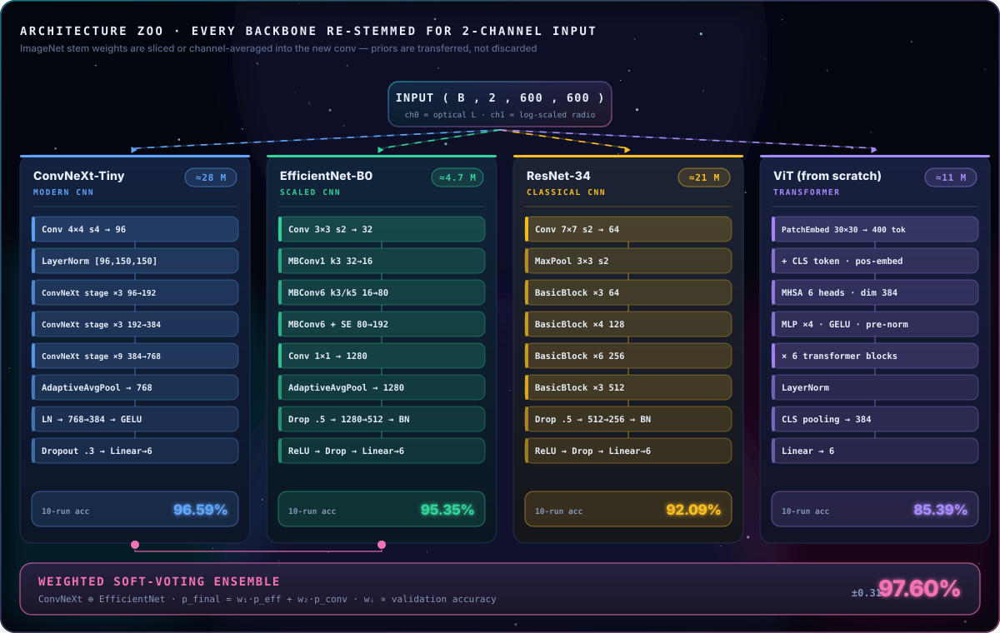

<details>
<summary>🟦 <b>ConvNeXt-Tiny</b> — champion single model · <code>models/convnext_model.py</code></summary>

```python
# Original stem:  Conv2d(3, 96, k=4, s=4)
# Re-stemmed:     Conv2d(2, 96, k=4, s=4) + LayerNorm([96, 150, 150])
self.stem[0].weight.data = pretrained_weight[:, :2, :, :].clone()   # R,G → optical, radio
```

| | |
|---|---|
| **Stem** | 4×4 stride-4 patchify conv, 2→96, ImageNet weights sliced |
| **Body** | full ConvNeXt-Tiny stack — depthwise 7×7, inverted bottleneck, LN, GELU |
| **Head** | `Flatten → LN(768) → Drop .3 → 768→384 → GELU → Drop .15 → 384→6` |
| **Init** | truncated-normal σ=0.02, zero bias |
| **Result** | 🏅 **96.59 % ± 0.22 %** — tightest CI in the zoo |

</details>

<details>
<summary>🟩 <b>EfficientNet-B0</b> — efficiency king · <code>models/efficientnet_model.py</code></summary>

| | |
|---|---|
| **Stem** | `Conv2d(2, 32, k=3, s=2, p=1, bias=False)`, pretrained weights sliced |
| **Body** | MBConv blocks with squeeze-and-excitation, compound-scaled |
| **Head** | `Drop .5 → 1280→512 → BN → ReLU → Drop .25 → 512→6` |
| **Params** | ≈4.7 M — **6× smaller than ConvNeXt** |
| **Result** | **95.35 % ± 0.42 %** at 17 % of the parameter budget |

</details>

<details>
<summary>🟨 <b>ResNet-34</b> — honest baseline · <code>models/resnet_model.py</code></summary>

```python
# RGB kernels are channel-averaged, then broadcast to 2 channels —
# preserves the learned edge/texture filters rather than discarding them.
self.conv1.weight.data = pretrained_weight.mean(dim=1, keepdim=True).repeat(1, 2, 1, 1)
```

| | |
|---|---|
| **Stem** | `Conv2d(2, 64, k=7, s=2, p=3)` — channel-averaged pretrained kernels |
| **Head** | `Drop .5 → 512→256 → BN → ReLU → Drop .25 → 256→6` |
| **Extra** | graceful degradation — falls back to random init if the weight download fails |
| **Result** | **92.09 % ± 0.60 %** — a credible floor |

</details>

<details>
<summary>🟪 <b>Vision Transformer</b> — built from scratch, no pretraining · <code>models/vit_model.py</code></summary>

Implemented from first principles: patch embedding, multi-head self-attention with `qkv` projection and `1/√d` scaling, pre-norm blocks with residuals, GELU MLP, learnable positional embeddings and CLS token.

| | |
|---|---|
| **Patching** | 30×30 patches over 600×600 → **400 tokens** |
| **Width / depth / heads** | 384 / 6 / 6 · MLP ratio 4.0 · dropout 0.2 |
| **Pretraining** | ❌ **none** — trained entirely on ~4.8 k images |
| **Result** | **85.39 % ± 0.53 %** |

> 🔬 **The most scientifically interesting result in the benchmark.** The ViT is not "bad" — it is *data-starved*. Transformers must **learn** locality and translation equivariance; a CNN gets them for free. With ~4.8 k training images, that ~11 pp gap is precisely the value of a good inductive bias.

</details>

### ⚖️ The ensemble

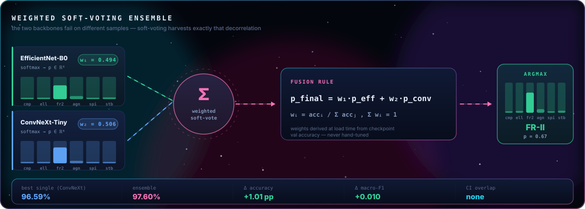

Weights are **derived from validation accuracy at load time**, never hand-tuned — the ensemble self-calibrates to whichever checkpoints you hand it. Three modes are implemented: `average`, `vote`, `weighted`.
<sub>→ `models/ensemble_model.py` · `training/evaluate_ensemble.py`</sub>

---

## 📊 Benchmark results


<div align="center">

| 🥇 | Model | Type | Params | **Accuracy (mean ± 95 % CI)** | F1 | AUC |
|:--:|---|---|--:|:--:|:--:|:--:|
| 🥇 | **Ensemble** *(ConvNeXt ⊕ EfficientNet)* | weighted soft-voting | ≈33 M | **97.60 % ± 0.31 %** | **0.976** | **0.999** |
| 🥈 | **ConvNeXt-Tiny** | modern CNN | ≈28 M | **96.59 % ± 0.22 %** | 0.966 | 0.998 |
| 🥉 | **EfficientNet-B0** | scaled CNN | ≈4.7 M | 95.35 % ± 0.42 % | 0.953 | 0.997 |
| 4 | **ResNet-34** | classical CNN | ≈21 M | 92.09 % ± 0.60 % | 0.921 | 0.992 |
| 5 | **ViT** *(from scratch)* | transformer | ≈11 M | 85.39 % ± 0.53 % | 0.852 | 0.978 |

</div>

**What the numbers actually say**

- **Modern CNN inductive biases win.** ConvNeXt-Tiny beats a from-scratch ViT by **+11.2 pp** on ~4.8 k training images.
- **Parameter efficiency is real.** EfficientNet-B0 reaches **95.35 %** with **6× fewer parameters** — the best accuracy-per-FLOP in the zoo.
- **The ensemble is not a rounding error.** +1.01 pp over the best single model with **non-overlapping confidence intervals** — the two backbones make *decorrelated* errors, which is exactly what soft-voting exploits.
- **Every model is stable.** The widest CI in the table is ±0.60 pp.

---

## 🎛️ Training recipe

<div align="center">

| Hyper-parameter | 🟦 ConvNeXt | 🟩 EfficientNet | 🟨 ResNet-34 | 🟪 ViT |
|---|:--:|:--:|:--:|:--:|
| Batch size | 12 | 12 | 16 | 8 |
| Epochs | 100 | 100 | 100 | 150 |
| Learning rate | 1e-4 | 1e-4 | 1e-4 | 5e-5 |
| Weight decay | 0.05 | 0.01 | 0.01 | 0.05 |
| Dropout | 0.3 | 0.5 | 0.5 | 0.2 |
| Scheduler `T₀` | 10 | 10 | 10 | 15 |

</div>

Shared across every run (`training/base_trainer.py`):

<table>
<tr>
<td>⚙️ <b>Optimiser</b></td><td><code>AdamW</code> — decoupled weight decay</td>
<td>📉 <b>Scheduler</b></td><td><code>CosineAnnealingWarmRestarts</code> · T_mult 2 · η_min 1e-6</td>
</tr>
<tr>
<td>🎯 <b>Loss</b></td><td><code>CrossEntropyLoss</code> (+ optional class weights)</td>
<td>⚡ <b>Precision</b></td><td>mixed FP16 via <code>torch.amp</code> + <code>GradScaler</code></td>
</tr>
<tr>
<td>✂️ <b>Grad clipping</b></td><td><code>clip_grad_norm_(1.0)</code>, applied post-unscale</td>
<td>🛑 <b>Early stopping</b></td><td>patience 15 on validation accuracy</td>
</tr>
<tr>
<td>🎲 <b>Split</b></td><td>stratified 80/20, seed 42</td>
<td>💾 <b>Checkpointing</b></td><td>best-val model + optimiser + scheduler + scaler state</td>
</tr>
</table>

<sub>🖥️ NVIDIA RTX A4000 (16 GB). Full-resolution 600×600 2-channel training at batch 12 is only feasible because of AMP — FP32 would OOM.</sub>

---

## 🔬 Evaluation protocol

Most projects report one number from one run. This one doesn't.


<sub>→ `testing/test_model_multirun.py` · `testing/test_ensemble_multirun.py` · `testing/compare_models_multirun.py` · `utils/metrics_tracker.py`</sub>

---

## 🎨 Second track — generative radio → optical translation

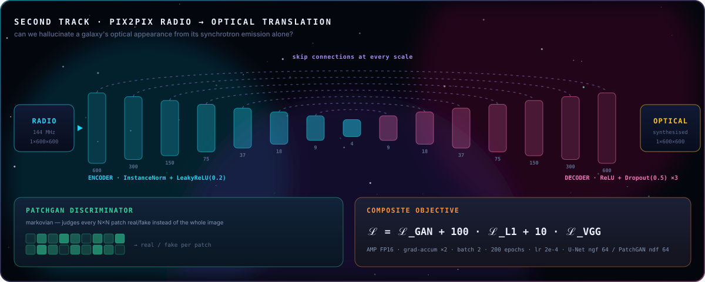

<sub>→ `models/spadegan_model.py` · `training/train_gan.py` (587 lines)</sub>

---

## 🚀 Quickstart

### 1 · Install

```bash
git clone https://github.com/DAISHINKAN7/Radio-Optical-Classification.git
cd Radio-Optical-Classification
python -m venv venv && source venv/bin/activate      # Windows: venv\Scripts\activate
pip install -r requirements.txt
```

### 2 · Build the dataset

```bash
python beautiful_downloader_v2.py     # query surveys + download paired cutouts
python boost_elliptical.py            # top up under-represented classes
python analyze_data.py                # → analysis_results/
python complete_ml_analysis.py        # → ml_analysis_results/
```

Expected layout:

```
data/beautiful_dataset_v2/
└── <class_name>/
    ├── optical/     *.jpg     512×512 RGB
    ├── radio/       *.fits    raw LOFAR 144 MHz
    └── radio_png/   *.png     600×600 rendered
```

### 3 · Train

```bash
python training/train_convnext.py     --data_path data/beautiful_dataset_v2 --output_dir outputs/convnext     --device cuda
python training/train_efficientnet.py --data_path data/beautiful_dataset_v2 --output_dir outputs/efficientnet --device cuda
python training/train_resnet.py       --data_path data/beautiful_dataset_v2 --output_dir outputs/resnet       --device cuda
python training/train_vit.py          --data_path data/beautiful_dataset_v2 --output_dir outputs/vit          --device cuda
```

<details>
<summary>🎨 Train the radio → optical GAN</summary>

```bash
python training/train_gan.py \
    --data_path data/beautiful_dataset_v2 \
    --output_dir outputs/gan_radio2optical \
    --mode radio2optical \
    --batch_size 4 --num_epochs 200 --device cuda
```
</details>

### 4 · Evaluate — the full 10-run statistical suite

```bash
python testing/test_model_multirun.py --model convnext     --checkpoint outputs/convnext/best_model.pth     --output_dir outputs/convnext_multirun     --num_runs 10 --device cuda
python testing/test_model_multirun.py --model efficientnet --checkpoint outputs/efficientnet/best_model.pth --output_dir outputs/efficientnet_multirun --num_runs 10 --device cuda
python testing/test_model_multirun.py --model resnet       --checkpoint outputs/resnet/best_model.pth       --output_dir outputs/resnet_multirun       --num_runs 10 --device cuda
python testing/test_model_multirun.py --model vit          --checkpoint outputs/vit/best_model.pth          --output_dir outputs/vit_multirun          --num_runs 10 --device cuda

python testing/test_ensemble_multirun.py \
    --efficientnet_path outputs/efficientnet/best_model.pth \
    --convnext_path     outputs/convnext/best_model.pth \
    --output_dir outputs/ensemble_multirun \
    --method weighted --num_runs 10 --device cuda

python testing/compare_models_multirun.py     # t-tests + ANOVA + boxplots
```

<sub>💡 All of the above is also in [`run_all_testing_commands.txt`](run_all_testing_commands.txt).</sub>

---

## 📁 Repository structure

```
Radio-Optical-Classification/
│
├── 🛰️  DATA ACQUISITION
│   ├── beautiful_downloader_v2.py          # SDSS SQL + VizieR → LoTSS / Legacy cutouts
│   ├── beautiful_downloader_multiple.py    # multi-class parallel acquisition
│   ├── boost_elliptical.py                 # targeted class top-up (72 → 1,008)
│   ├── analyse_dataset.py  ·  analyze_data.py
│   ├── complete_ml_analysis.py             # ML-readiness audit + memory profiling
│   └── check_color.py  ·  debug_dataset.py  ·  test_v2.py
│
├── 📦  data/
│   ├── dataset.py                          # LoTSSDataset — paired loader + stratified split
│   ├── preprocessing.py                    # per-modality normalisation, log1p on radio
│   └── augmentation.py                     # locked geometric + per-modality photometric
│
├── 🧠  models/
│   ├── convnext_model.py                   # ConvNeXt-Tiny,   2-ch re-stem
│   ├── efficientnet_model.py               # EfficientNet-B0, 2-ch re-stem
│   ├── resnet_model.py                     # ResNet-34,       2-ch re-stem
│   ├── vit_model.py                        # ViT from scratch (MHSA implemented by hand)
│   ├── ensemble_model.py                   # average / vote / weighted soft-voting
│   └── spadegan_model.py                   # Pix2Pix U-Net generator + PatchGAN
│
├── 🏋️  training/
│   ├── base_trainer.py                     # AMP · AdamW · cosine warm restarts · early stop
│   ├── train_{convnext,efficientnet,resnet,vit}.py
│   ├── train_gan.py                        # GAN + L1 + VGG perceptual
│   └── evaluate_ensemble.py
│
├── 🔬  testing/
│   ├── test_model.py                       # single-run deep evaluation
│   ├── test_model_multirun.py              # 10-run + 95 % CI + publication tables
│   ├── test_ensemble_multirun.py           # same, for the ensemble
│   ├── compare_models_multirun.py          # t-tests + ANOVA + boxplots
│   └── compare_all_models.py
│
├── 📊  utils/metrics_tracker.py
├── 🎨  visualisation/dataset_showcase.py
├── 🧹  clear_gpu.py
│
├── 📈  analysis_results/                    # dataset stats, sample grids, catalogue plots
├── 📉  ml_analysis_results/                 # validation report, splits, memory profile
└── 🖼️  assets/svg/                          # the diagrams rendered throughout this README
```

<sub>≈ 6,000 lines of Python across acquisition, data, models, training, evaluation and visualisation.</sub>

---

## ⚠️ Limitations & honest notes

Reporting what a project *cannot* do is part of doing science properly.

| # | Limitation | Impact | Planned fix |
|:-:|---|---|---|
| 1 | **The multi-run runner re-seeds the stratified split** each run instead of holding out one frozen test set, so runs 2–10 evaluate on samples the seed-42 checkpoint saw during training. | Reported accuracies are likely **optimistic**; the CIs measure split variance, not pure generalisation. | Freeze a single 15 % test split, hold it out of *all* training, vary only the inference seed. ⭐ **highest-priority next step** |
| 2 | **Labels come from catalogue cross-matching**, not expert visual inspection. | Inherits SDSS / LoTSS selection biases and catalogue label noise. | Spot-check a stratified subsample against expert-labelled catalogues (Radio Galaxy Zoo). |
| 3 | **Classes are not mutually exclusive physically** — radio-loud AGN are hosted by ellipticals. | Some "errors" are ontological, not perceptual. | Reframe as multi-label, or merge into a physically disjoint taxonomy. |
| 4 | **The ViT was trained from scratch** while the CNNs are ImageNet-pretrained. | The CNN-vs-transformer comparison is not perfectly like-for-like. | Fine-tune a pretrained ViT-B/16 with a 2-channel re-stem. |
| 5 | **No calibration analysis.** | Softmax confidence may be over-confident — important if this ever feeds a real survey pipeline. | Reliability diagrams, ECE, temperature scaling. |
| 6 | **No interpretability yet.** | We know *that* it works, not *why*. | Grad-CAM / attention rollout per modality. |

---

## 🗺️ Roadmap

- [ ] 🔒 Frozen held-out test split + leakage-free multi-seed protocol
- [ ] 🔍 Grad-CAM / attention rollout per modality — *does the network look at the lobes or the host?*
- [ ] 🧊 Late-fusion dual-encoder (separate radio & optical towers + cross-attention)
- [ ] 🎯 Pretrained ViT / Swin with 2-channel adaptation
- [ ] 🌡️ Confidence calibration — temperature scaling, ECE, reliability diagrams
- [ ] 🎭 GAN-augmented training — synthesise minority-class pairs
- [ ] 🌍 Scale to the full LoTSS DR2 catalogue (4.4 M sources)
- [ ] 📤 ONNX / TorchScript export + a lightweight inference API

---

## 📚 Data sources & acknowledgements

<div align="center">

| Survey | Role | Reference |
|---|---|---|
| 📡 **LoFAR Two-metre Sky Survey (LoTSS) DR2** | 144 MHz radio cutouts | [lofar-surveys.org](https://lofar-surveys.org/) |
| 🌈 **SDSS DR17** | optical imaging + source catalogues | [sdss.org](https://www.sdss.org/) |
| 🔭 **DESI Legacy Imaging Surveys** | optical fallback cutouts | [legacysurvey.org](https://www.legacysurvey.org/) |
| 🗂️ **VizieR / CDS** | catalogue cross-matching | [vizier.cds.unistra.fr](https://vizier.cds.unistra.fr/) |

</div>

Built on **PyTorch**, **torchvision**, **Astropy**, **Astroquery**, **scikit-learn**, **SciPy**, **OpenCV**, **pandas**, **Matplotlib** and **seaborn**.
Architectures courtesy of **FAIR** (ConvNeXt), **Google Brain** (EfficientNet, ViT) and **Microsoft Research** (ResNet).

---

## 📖 Citation

```bibtex
@software{radio_optical_classification,
  title  = {Radio--Optical Galaxy Morphology Classification:
            A Multimodal Deep Learning Benchmark on LoTSS DR2 x SDSS},
  author = {Ajgaonkar, Kunal},
  year   = {2025},
  url    = {https://github.com/DAISHINKAN7/Radio-Optical-Classification},
  note   = {6,010 paired radio--optical cutouts; ConvNeXt, EfficientNet, ResNet,
            ViT and weighted-ensemble benchmark with 10-run statistical evaluation}
}
```

---

## 📜 License

Released under the **MIT License**. Survey data remains subject to the terms of LOFAR / ASTRON, SDSS and the DESI Legacy Imaging Surveys.

---

<p align="center">
  
</p>
