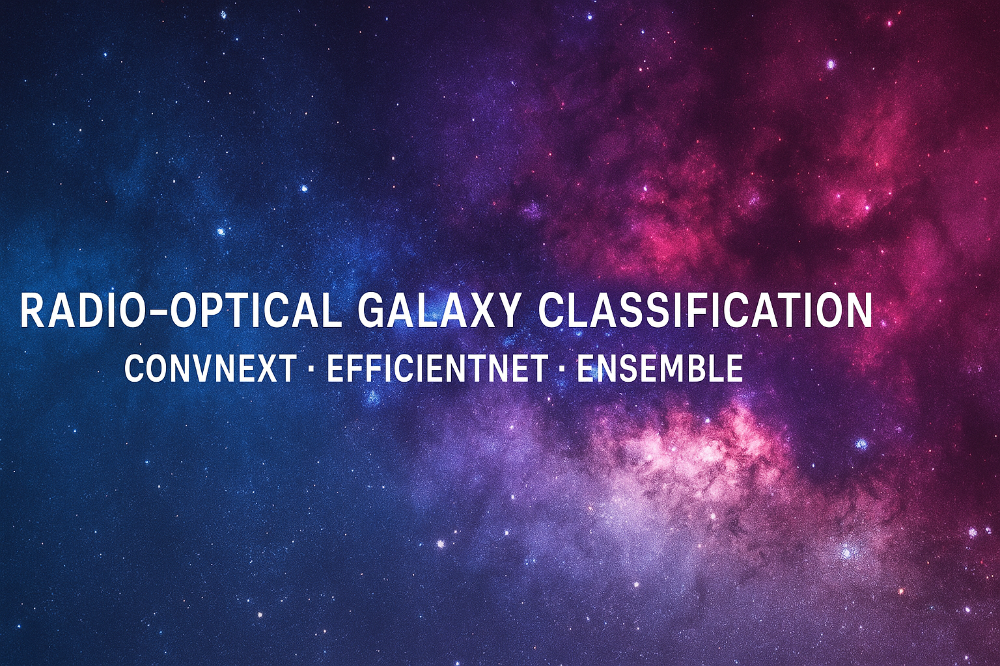
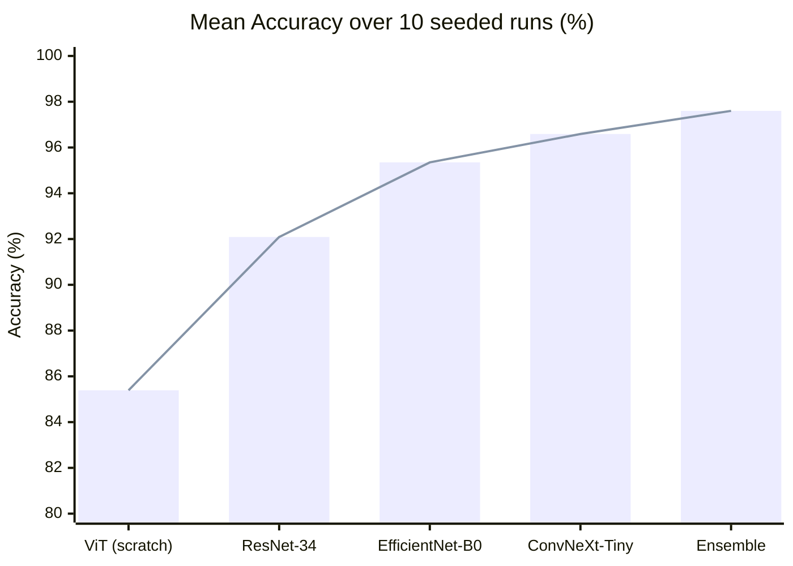
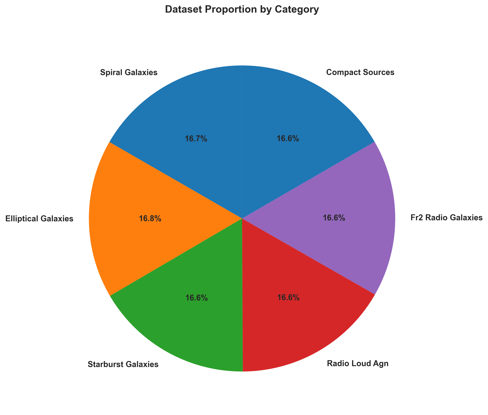
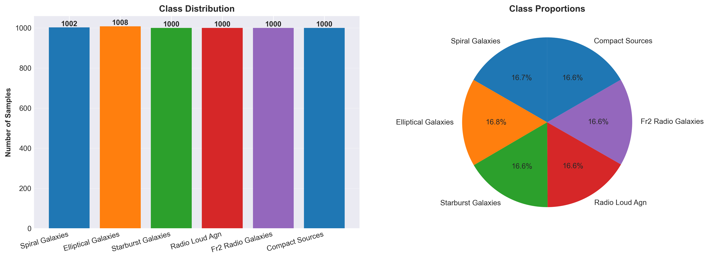
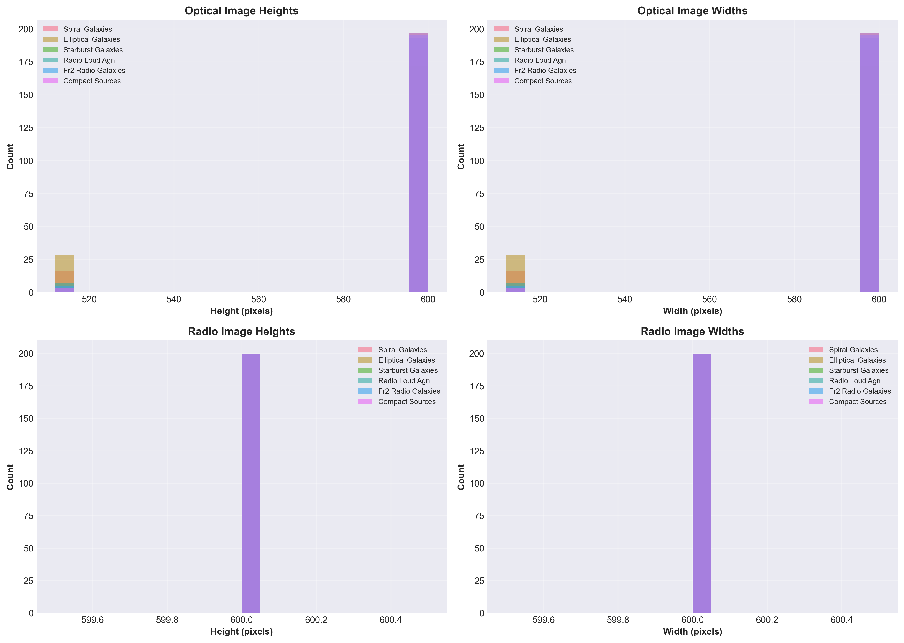
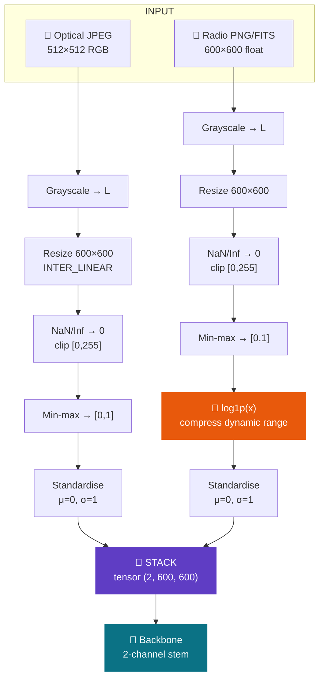
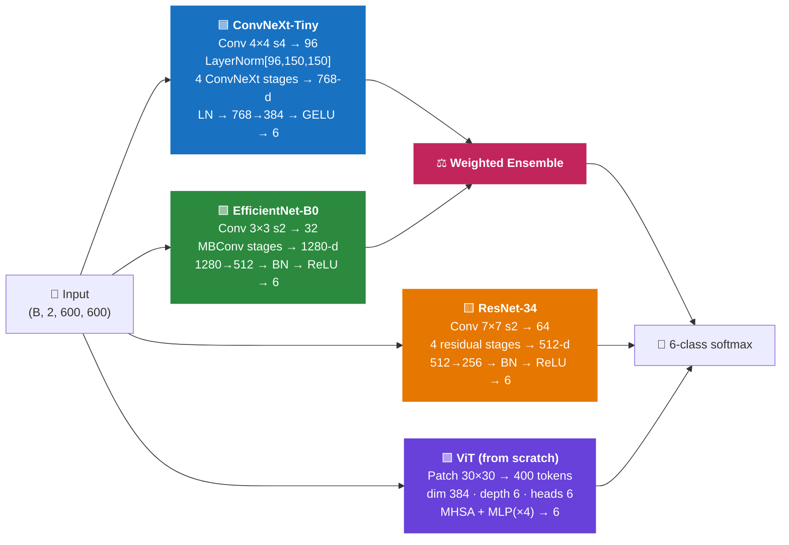
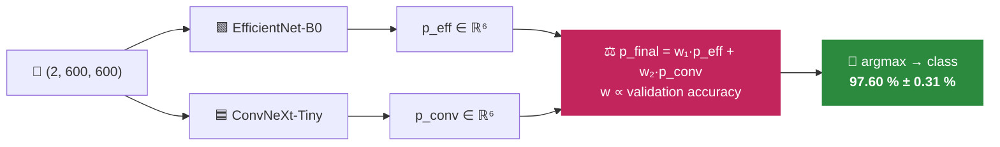
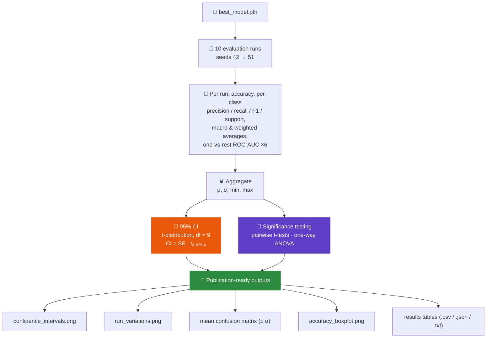

<p align="center">
  
</p>

<h1 align="center">
  🌌 &nbsp;Radio–Optical Galaxy Morphology Classification&nbsp; 🔭
</h1>

<p align="center">
  <b>A multimodal deep-learning benchmark on a 6,010-pair LOFAR × SDSS dataset built entirely from raw survey APIs.</b>
</p>

<p align="center">
  <i>ConvNeXt · EfficientNet · ResNet · Vision Transformer · Weighted Ensemble · Pix2Pix GAN</i><br>
  <i>Evaluated over 10 seeded runs with 95% confidence intervals, pairwise t-tests and one-way ANOVA.</i>
</p>

<p align="center">
  
  
  
  
</p>

<p align="center">
  
  
  
  
  
  
  
  
</p>

<p align="center">
  <a href="#-the-problem">Problem</a> ·
  <a href="#-headline-results">Results</a> ·
  <a href="#-the-dataset--built-from-scratch">Dataset</a> ·
  <a href="#-architecture-zoo">Architectures</a> ·
  <a href="#-the-ensemble">Ensemble</a> ·
  <a href="#-evaluation-protocol">Protocol</a> ·
  <a href="#-quickstart">Quickstart</a> ·
  <a href="#-limitations--honest-notes">Limitations</a>
</p>

---

## 🎯 The Problem

> **Can a neural network tell what kind of galaxy it is looking at, when the only evidence is a faint smudge of synchrotron radio emission and a blurry optical postage stamp?**

Radio astronomy is drowning in data. LOFAR's **LoTSS DR2** alone catalogued **4.4 million radio sources** — and next-generation instruments like the SKA will produce orders of magnitude more. Human classification does not scale. But automated morphological classification of radio sources is genuinely hard:

<table>
<tr>
<td width="50%" valign="top">

### 😖 Why this is difficult

| Challenge | Why it hurts |
|---|---|
| 🌫️ **Extreme sparsity** | Radio maps are ~99% empty sky with a handful of bright pixels spanning 4+ orders of magnitude |
| 🔀 **Cross-modal misalignment** | Radio lobes can extend far beyond the optical host galaxy — the "object" lives in two different places |
| 🎭 **Class ambiguity** | A radio-loud AGN *is* hosted by an elliptical. The boundary is physical, not visual |
| 📡 **Resolution mismatch** | 6″ LOFAR beam vs. ~1″ optical seeing |
| 🕳️ **NaN-riddled FITS** | Real interferometric data has blanked pixels, negative sidelobes, and per-field noise |
| 🧩 **No off-the-shelf dataset** | There is no `torchvision.datasets.LoTSS` — the dataset had to be *constructed* |

</td>
<td width="50%" valign="top">

### 💡 What this project does about it

```
 ✔  Builds a balanced 6-class multimodal dataset
    from raw survey APIs — 6,010 validated pairs

 ✔  Fuses radio + optical as a 2-channel tensor
    with modality-specific normalisation
    (log1p compression on the radio channel)

 ✔  Surgically re-stems 4 pretrained backbones
    for 2-channel input, preserving ImageNet
    features instead of discarding them

 ✔  Benchmarks CNN vs. modern-CNN vs. scaled-CNN
    vs. transformer under identical conditions

 ✔  Reports every number with a 95% CI over
    10 seeded runs + significance testing

 ✔  Explores generative radio→optical translation
    with a Pix2Pix U-Net + PatchGAN
```

</td>
</tr>
</table>

---

## 🏆 Headline Results

<div align="center">

| 🥇 | Model | Type | Params | **Accuracy (mean ± 95% CI)** | F1 | AUC |
|:--:|---|---|--:|:--:|:--:|:--:|
| 🥇 | **Ensemble** *(ConvNeXt + EfficientNet)* | Weighted soft-voting | ≈33 M | **97.60 % ± 0.31 %** | **0.976** | **0.999** |
| 🥈 | **ConvNeXt-Tiny** | Modern CNN | ≈28 M | **96.59 % ± 0.22 %** | 0.966 | 0.998 |
| 🥉 | **EfficientNet-B0** | Scaled CNN | ≈4.7 M | 95.35 % ± 0.42 % | 0.953 | 0.997 |
| 4 | **ResNet-34** | Classical CNN | ≈21 M | 92.09 % ± 0.60 % | 0.921 | 0.992 |
| 5 | **ViT** *(trained from scratch)* | Transformer | ≈11 M | 85.39 % ± 0.53 % | 0.852 | 0.978 |

</div>



<table>
<tr><td>

### 🔍 What the numbers actually say

- **Modern CNN inductive biases win.** ConvNeXt-Tiny beats a from-scratch ViT by **+11.2 pp**. With only ~4.8k training images, the transformer has no way to learn the locality priors that convolutions get for free.
- **Parameter efficiency is real.** EfficientNet-B0 reaches **95.35%** with **6× fewer parameters** than ConvNeXt — the best accuracy-per-FLOP in the zoo.
- **The ensemble is not a rounding error.** +1.01 pp over the best single model, with **non-overlapping confidence intervals** — the two backbones make *decorrelated* errors, which is exactly what soft-voting exploits.
- **Every model is remarkably stable.** The widest CI in the table is ±0.60 pp. This is a well-conditioned problem once the preprocessing is right.

</td></tr>
</table>

---

## 🛰️ The Dataset — Built From Scratch

> There is no public, balanced, paired radio–optical morphology dataset. So this project builds one.

<p align="center">
  
  
</p>

### 🔭 Acquisition pipeline

```mermaid
flowchart LR
    subgraph Q["🗄️ 1 · CATALOGUE QUERY"]
        A1["SDSS DR17<br/>SQL / SkyServer"]
        A2["VizieR<br/>LoTSS DR2 catalogues"]
    end

    subgraph F["🎯 2 · COVERAGE FILTER"]
        B1["Cross-match RA/Dec<br/>LoTSS ∩ SDSS footprint"]
        B2["Physical cuts<br/>flux ratio, magnitude,<br/>redshift, morphology flags"]
    end

    subgraph D["⬇️ 3 · PARALLEL CUTOUT DOWNLOAD"]
        C1["📡 LOFAR 144 MHz<br/>lofar-surveys.org<br/>dr2-cutout.fits<br/>15′ @ 1.5″ → 600×600"]
        C2["🌈 Optical<br/>SDSS ImgCutout<br/>↳ fallback: Legacy Survey<br/>512×512 RGB"]
    end

    subgraph V["✅ 4 · VALIDATION"]
        E1["SNR check on radio"]
        E2["Brightness / contrast<br/>check on optical"]
        E3["Pair completeness<br/>+ corruption scan"]
    end

    Q --> F --> D --> V --> OUT[("🗂️ 6,010 verified pairs<br/>18.84 GB · 6 classes")]

    style Q fill:#0b7285,stroke:#0b7285,color:#fff
    style F fill:#5f3dc4,stroke:#5f3dc4,color:#fff
    style D fill:#c2255c,stroke:#c2255c,color:#fff
    style V fill:#2b8a3e,stroke:#2b8a3e,color:#fff
    style OUT fill:#e8590c,stroke:#e8590c,color:#fff
```



Implemented with **16-worker `ThreadPoolExecutor` concurrency**, per-service fallback, retry logic, and on-the-fly validation — see `beautiful_downloader_v2.py`, `beautiful_downloader_multiple.py`, and `boost_elliptical.py` (a targeted top-up script that grew the elliptical class from 72 → 1,008 samples by relaxing selection criteria).

### 📊 The six classes

<div align="center">

| # | Class | Pairs | Share | Physical signature |
|:-:|---|--:|--:|---|
| 0 | 🔵 **Compact Sources** | 1,000 | 16.64 % | Unresolved single radio component |
| 1 | 🟠 **Elliptical Galaxies** | 1,008 | 16.77 % | Smooth de Vaucouleurs optical profile |
| 2 | 🔴 **FR-II Radio Galaxies** | 1,000 | 16.64 % | Edge-brightened twin lobes + hotspots |
| 3 | 🟣 **Radio-Loud AGN** | 1,000 | 16.64 % | Dominant core, high radio-to-optical ratio |
| 4 | 🟢 **Spiral Galaxies** | 1,002 | 16.67 % | Disc + arms, extended star formation |
| 5 | 🟡 **Starburst Galaxies** | 1,000 | 16.64 % | Compact, high-SFR, blue optical excess |
| | **TOTAL** | **6,010** | **100 %** | **Near-perfectly balanced by construction** |

</div>

### 🖼️ Sample grids

<p align="center">
  
  
  
</p>
<p align="center">
  
  
  
</p>
<p align="center"><i>Left→right, top→bottom: Spiral · Elliptical · FR-II · Radio-Loud AGN · Starburst · Compact</i></p>

### 🧪 Dataset integrity report

```
╔══════════════════════════════════════════════════════════════════╗
║  VALIDATION REPORT                        ml_analysis_results/   ║
╠══════════════════════════════════════════════════════════════════╣
║  Total pairs validated ........................... 6,010          ║
║  Corrupted optical images ........................     0  ✅     ║
║  Corrupted radio FITS ............................     0  ✅     ║
║  Mismatched / unpaired samples ...................     0  ✅     ║
║  Missing radio PNG renders .......................     1         ║
║  Class imbalance (max−min) ....................... 0.13 pp ✅    ║
╚══════════════════════════════════════════════════════════════════╝
```

<details>
<summary>📈 <b>More dataset analytics</b> (click to expand)</summary>
<br>
<p align="center">
  <br>
  <i>Redshift, magnitude and sky-coverage distributions of the source catalogue</i>
</p>
<p align="center">
  
  <br>
  <i>Left: file-size & brightness distributions · Right: per-channel pixel statistics</i>
</p>
<p align="center">
  <br>
  <i>Image dimension distributions across modalities</i>
</p>

Full reports: [`analysis_results/summary_report.txt`](analysis_results/summary_report.txt) ·
[`ml_analysis_results/ml_analysis_report.txt`](ml_analysis_results/ml_analysis_report.txt) ·
[`ml_analysis_results/validation_report.json`](ml_analysis_results/validation_report.json)
</details>

---

## ⚗️ Multimodal Preprocessing

The single most important design decision in this project: **radio and optical are physically different measurements and must never share a normalisation.**



> **Why `log1p` on the radio channel only?**
> Synchrotron flux spans several orders of magnitude within one cutout — a bright hotspot can be 10⁴× the diffuse lobe. Linear normalisation crushes every faint structure to zero. Logarithmic compression is standard practice in radio astronomy and it is what makes FR-II lobes visible to the network at all.

### 🔄 Physics-aware augmentation

Augmentation is split into **geometric** (applied identically to both channels, so the pair stays registered) and **photometric** (applied per-modality, because the two instruments have different noise physics).

| Transform | Applied to | Setting | Astrophysical justification |
|---|---|---|---|
| Rotation 0/90/180/270° | 🔗 both, locked | p = 0.7 | Galaxies have no canonical "up" — full rotational symmetry |
| H / V flip | 🔗 both, locked | p = 0.5 each | Parity is not physically meaningful on the sky |
| Brightness × contrast | 🌈 optical only | ×0.8–1.2 | Simulates seeing / calibration variation |
| Brightness | 📡 radio only | ×0.9–1.1 | Conservative — flux carries the class signal |
| Gaussian blur | 📡 radio only | σ 0.3–0.7, p = 0.3 | Simulates varying synthesised-beam size |
| Gaussian noise | 🔗 both | σ = 0.05 / 0.03 | Simulates detector + thermal noise floor |
| ❌ Colour jitter | — | **never** | Colour *is* the astrophysics — jittering destroys the label |

<sub>📄 `data/preprocessing.py` · `data/augmentation.py` · `data/dataset.py`</sub>

---

## 🧠 Architecture Zoo

Every backbone is **re-stemmed for 2-channel input**. Crucially, the ImageNet-pretrained stem weights are *not* thrown away — they are sliced or channel-averaged into the new convolution, so the network starts from real visual priors instead of random noise.



<details>
<summary>🟦 <b>ConvNeXt-Tiny</b> — the champion single model &nbsp;·&nbsp; <code>models/convnext_model.py</code></summary>

```python
# Original stem:  Conv2d(3, 96, k=4, s=4)
# Re-stemmed:     Conv2d(2, 96, k=4, s=4) + LayerNorm([96, 150, 150])
self.stem[0].weight.data = pretrained_weight[:, :2, :, :].clone()   # slice R,G → optical, radio
```

| | |
|---|---|
| **Stem** | 4×4 stride-4 patchify conv, 2→96, ImageNet weights sliced to 2 channels |
| **Body** | Full ConvNeXt-Tiny stage stack (depthwise 7×7, inverted bottleneck, LayerNorm, GELU) |
| **Head** | `Flatten → LayerNorm(768) → Dropout(0.3) → Linear(768→384) → GELU → Dropout(0.15) → Linear(384→6)` |
| **Init** | Truncated-normal (σ=0.02) on head, zero bias |
| **Params** | ≈28 M |
| **Result** | 🏅 **96.59 % ± 0.22 %** — best single model, tightest CI in the zoo |

</details>

<details>
<summary>🟩 <b>EfficientNet-B0</b> — the efficiency king &nbsp;·&nbsp; <code>models/efficientnet_model.py</code></summary>

| | |
|---|---|
| **Stem** | `Conv2d(2, 32, k=3, s=2, p=1, bias=False)`, pretrained weights sliced |
| **Body** | MBConv blocks with squeeze-and-excitation, compound-scaled |
| **Head** | `Dropout(0.5) → Linear(1280→512) → BatchNorm → ReLU → Dropout(0.25) → Linear(512→6)` |
| **Init** | Kaiming-normal (`fan_out`) |
| **Params** | ≈4.7 M — **6× smaller than ConvNeXt** |
| **Result** | **95.35 % ± 0.42 %** at 17% of the parameter budget |

</details>

<details>
<summary>🟨 <b>ResNet-34</b> — the honest baseline &nbsp;·&nbsp; <code>models/resnet_model.py</code></summary>

```python
# RGB kernels are channel-averaged, then broadcast to 2 channels —
# preserves the learned edge/texture filters rather than discarding them.
self.conv1.weight.data = pretrained_weight.mean(dim=1, keepdim=True).repeat(1, 2, 1, 1)
```

| | |
|---|---|
| **Stem** | `Conv2d(2, 64, k=7, s=2, p=3)` — channel-averaged pretrained kernels |
| **Body** | 4 stages of basic residual blocks |
| **Head** | `Dropout(0.5) → Linear(512→256) → BatchNorm → ReLU → Dropout(0.25) → Linear(256→6)` |
| **Extra** | Graceful degradation — falls back to random init if the weight download fails |
| **Params** | ≈21 M |
| **Result** | **92.09 % ± 0.60 %** — a strong, credible floor |

</details>

<details>
<summary>🟪 <b>Vision Transformer</b> — built from scratch, no pretraining &nbsp;·&nbsp; <code>models/vit_model.py</code></summary>

Implemented from first principles: patch embedding, multi-head self-attention with `qkv` projection and `1/√d` scaling, pre-norm transformer blocks with residual connections, GELU MLP, learnable positional embeddings and CLS token.

| | |
|---|---|
| **Patching** | 30×30 patches over 600×600 → **400 tokens** |
| **Width / depth / heads** | 384 / 6 / 6 |
| **MLP ratio** | 4.0 |
| **Dropout** | 0.2 |
| **Pretraining** | ❌ **none** — trained entirely on 4.8k images |
| **Params** | ≈11 M |
| **Result** | **85.39 % ± 0.53 %** |

> 🔬 **This is the most scientifically interesting result in the benchmark.** The ViT is not "bad" — it is *data-starved*. Transformers must **learn** locality and translation equivariance from data, whereas a CNN has them hard-wired. With ~4.8k training images, that ~11 pp gap is precisely the value of a good inductive bias. A pretrained ViT-B/16 would likely close most of it — a clear next experiment.

</details>

<details>
<summary>🎨 <b>Pix2Pix GAN</b> — generative radio ↔ optical translation &nbsp;·&nbsp; <code>models/spadegan_model.py</code></summary>

A second research track: can we *hallucinate* the optical appearance of a galaxy from its radio emission alone (or vice versa)?

```
U-Net Generator          600 → 300 → 150 → 75 → 37 → 18 → 9 → 4   (7 down)
                          ↕  skip connections at every scale  ↕
                          4 → 9 → 18 → 37 → 75 → 150 → 300 → 600  (6 up + final)
  · InstanceNorm + LeakyReLU(0.2) encoder, ReLU decoder
  · Dropout 0.5 on the three deepest decoder blocks
  · Bilinear interpolation guard against odd-size skip mismatch

PatchGAN Discriminator   markovian, per-patch real/fake

Objective   L_total = L_GAN + 100·L_L1 + 10·L_VGG(perceptual)
Training    AMP FP16 · gradient accumulation ×2 · batch 2 · 200 epochs · lr 2e-4
```

</details>

---

## ⚖️ The Ensemble

The two strongest backbones are fused by **confidence-weighted soft voting** over softmax probability vectors — three modes are implemented (`average`, `vote`, `weighted`).



<div align="center">

$$p_{\text{final}} = w_1 \cdot p_{\text{EfficientNet}} + w_2 \cdot p_{\text{ConvNeXt}}, \qquad w_i = \frac{\text{acc}_i}{\sum_j \text{acc}_j}, \qquad \sum_i w_i = 1$$

</div>

Weights are **derived from validation accuracy at load time**, not hand-tuned — so the ensemble self-calibrates to whichever checkpoints you hand it.

| | Best single (ConvNeXt) | Ensemble | Δ |
|---|:--:|:--:|:--:|
| Accuracy | 96.59 % | **97.60 %** | 🔼 **+1.01 pp** |
| Macro F1 | 0.966 | **0.976** | 🔼 +0.010 |
| AUC | 0.998 | **0.999** | 🔼 +0.001 |

> The gain is only possible because the two backbones fail on *different* samples. ConvNeXt's global patchify stem and EfficientNet's local MBConv hierarchy build genuinely different representations — their errors are decorrelated, and soft-voting harvests exactly that.

<sub>📄 `models/ensemble_model.py` · `training/evaluate_ensemble.py`</sub>

---

## 🎛️ Training Recipe

<div align="center">

| Hyper-parameter | 🟦 ConvNeXt | 🟩 EfficientNet | 🟨 ResNet-34 | 🟪 ViT |
|---|:--:|:--:|:--:|:--:|
| Batch size | 12 | 12 | 16 | 8 |
| Epochs | 100 | 100 | 100 | 150 |
| Learning rate | 1e-4 | 1e-4 | 1e-4 | 5e-5 |
| Weight decay | 0.05 | 0.01 | 0.01 | 0.05 |
| Dropout | 0.3 | 0.5 | 0.5 | 0.2 |
| Scheduler `T₀` | 10 | 10 | 10 | 15 |

</div>

**Shared across every run** (`training/base_trainer.py`):

<table>
<tr>
<td>⚙️ <b>Optimiser</b></td><td><code>AdamW</code> — decoupled weight decay</td>
<td>📉 <b>Scheduler</b></td><td><code>CosineAnnealingWarmRestarts</code> (T_mult=2, η_min=1e-6)</td>
</tr>
<tr>
<td>🎯 <b>Loss</b></td><td><code>CrossEntropyLoss</code> (+ optional class weights)</td>
<td>⚡ <b>Precision</b></td><td>Mixed FP16 via <code>torch.amp</code> + <code>GradScaler</code></td>
</tr>
<tr>
<td>✂️ <b>Grad clipping</b></td><td><code>clip_grad_norm_(max_norm=1.0)</code>, applied post-unscale</td>
<td>🛑 <b>Early stopping</b></td><td>patience = 15 on validation accuracy</td>
</tr>
<tr>
<td>🎲 <b>Split</b></td><td>Stratified 80 / 20, seed 42</td>
<td>💾 <b>Checkpointing</b></td><td>Best-val model + optimiser + scheduler + scaler state</td>
</tr>
</table>

**Hardware:** NVIDIA RTX A4000 (16 GB). Full-resolution 600×600 2-channel training at batch 12 is only feasible because of AMP — FP32 would OOM.

---

## 🔬 Evaluation Protocol

Most projects report one number from one run. This one doesn't.



<table>
<tr><td>

**Metrics computed per run** — accuracy · per-class precision/recall/F1/support · macro-average · weighted-average · one-vs-rest ROC-AUC for all six classes.

**Statistics** — mean ± 95% CI using Student's *t* with 9 degrees of freedom (not a normal approximation — the correct choice for n=10). Pairwise independent t-tests between every model pair with significance stars (`***` p<0.001, `**` p<0.01, `*` p<0.05, `ns`), plus a one-way ANOVA across all models.

**Artefacts** — every run emits stability plots, error-bar plots, aggregated confusion matrices with per-cell standard deviations, boxplots, and LaTeX-ready tables.

</td></tr>
</table>

<sub>📄 `testing/test_model_multirun.py` · `testing/test_ensemble_multirun.py` · `testing/compare_models_multirun.py` · `utils/metrics_tracker.py`</sub>

---

## 🚀 Quickstart

### 1 · Install

```bash
git clone https://github.com/DAISHINKAN7/Radio-Optical-Classification.git
cd Radio-Optical-Classification
python -m venv venv && source venv/bin/activate      # Windows: venv\Scripts\activate
pip install -r requirements.txt
```

### 2 · Build the dataset

```bash
python beautiful_downloader_v2.py          # query surveys + download paired cutouts
python boost_elliptical.py                 # top up under-represented classes
python analyze_data.py                     # → analysis_results/
python complete_ml_analysis.py             # → ml_analysis_results/
```

Expected layout:

```
data/beautiful_dataset_v2/
└── <class_name>/
    ├── optical/     *.jpg      512×512 RGB
    ├── radio/       *.fits     raw LOFAR 144 MHz
    └── radio_png/   *.png      600×600 rendered
```

### 3 · Train

```bash
python training/train_convnext.py      --data_path data/beautiful_dataset_v2 --output_dir outputs/convnext      --device cuda
python training/train_efficientnet.py  --data_path data/beautiful_dataset_v2 --output_dir outputs/efficientnet  --device cuda
python training/train_resnet.py        --data_path data/beautiful_dataset_v2 --output_dir outputs/resnet        --device cuda
python training/train_vit.py           --data_path data/beautiful_dataset_v2 --output_dir outputs/vit           --device cuda
```

<details>
<summary>🎨 Train the radio→optical GAN</summary>

```bash
python training/train_gan.py \
    --data_path data/beautiful_dataset_v2 \
    --output_dir outputs/gan_radio2optical \
    --mode radio2optical \
    --batch_size 4 --num_epochs 200 --device cuda
```
</details>

### 4 · Evaluate — the full 10-run statistical suite

```bash
# Individual models
python testing/test_model_multirun.py --model convnext     --checkpoint outputs/convnext/best_model.pth     --output_dir outputs/convnext_multirun     --num_runs 10 --device cuda
python testing/test_model_multirun.py --model efficientnet --checkpoint outputs/efficientnet/best_model.pth --output_dir outputs/efficientnet_multirun --num_runs 10 --device cuda
python testing/test_model_multirun.py --model resnet       --checkpoint outputs/resnet/best_model.pth       --output_dir outputs/resnet_multirun       --num_runs 10 --device cuda
python testing/test_model_multirun.py --model vit          --checkpoint outputs/vit/best_model.pth          --output_dir outputs/vit_multirun          --num_runs 10 --device cuda

# Ensemble
python testing/test_ensemble_multirun.py \
    --efficientnet_path outputs/efficientnet/best_model.pth \
    --convnext_path     outputs/convnext/best_model.pth \
    --output_dir outputs/ensemble_multirun \
    --method weighted --num_runs 10 --device cuda

# Cross-model comparison + significance testing
python testing/compare_models_multirun.py
```

<sub>💡 All of the above is also in [`run_all_testing_commands.txt`](run_all_testing_commands.txt).</sub>

---

## 📁 Repository Structure

```
Radio-Optical-Classification/
│
├── 🛰️  DATA ACQUISITION
│   ├── beautiful_downloader_v2.py          # SDSS SQL + VizieR → LoTSS/Legacy cutouts
│   ├── beautiful_downloader_multiple.py    # multi-class parallel acquisition
│   ├── boost_elliptical.py                 # targeted class top-up (72 → 1,008)
│   ├── analyse_dataset.py  /  analyze_data.py
│   ├── complete_ml_analysis.py             # ML-readiness audit + memory profiling
│   ├── check_color.py  /  debug_dataset.py  /  test_v2.py
│
├── 📦  data/
│   ├── dataset.py                          # LoTSSDataset — paired loader + stratified split
│   ├── preprocessing.py                    # per-modality normalisation, log1p radio
│   └── augmentation.py                     # locked geometric + per-modality photometric
│
├── 🧠  models/
│   ├── convnext_model.py                   # ConvNeXt-Tiny,  2-ch re-stem
│   ├── efficientnet_model.py               # EfficientNet-B0, 2-ch re-stem
│   ├── resnet_model.py                     # ResNet-34,      2-ch re-stem
│   ├── vit_model.py                        # ViT from scratch (MHSA implemented by hand)
│   ├── ensemble_model.py                   # average / vote / weighted soft-voting
│   └── spadegan_model.py                   # Pix2Pix U-Net generator + PatchGAN
│
├── 🏋️  training/
│   ├── base_trainer.py                     # AMP, AdamW, cosine warm restarts, early stop
│   ├── train_{convnext,efficientnet,resnet,vit}.py
│   ├── train_gan.py                        # GAN + L1 + VGG perceptual
│   └── evaluate_ensemble.py
│
├── 🔬  testing/
│   ├── test_model.py                       # single-run deep evaluation
│   ├── test_model_multirun.py              # 10-run + 95% CI + publication tables
│   ├── test_ensemble_multirun.py           # same, for the ensemble
│   ├── compare_models_multirun.py          # t-tests + ANOVA + boxplots
│   └── compare_all_models.py
│
├── 📊  utils/metrics_tracker.py
├── 🎨  visualisation/dataset_showcase.py
├── 🧹  clear_gpu.py
│
├── 📈  analysis_results/                   # dataset stats, sample grids, catalogue plots
└── 📉  ml_analysis_results/                # validation report, splits, memory profile
```

<sub>≈ 6,000 lines of Python across acquisition, data, models, training, evaluation and visualisation.</sub>

---

## ⚠️ Limitations & Honest Notes

Reporting what a project *cannot* do is part of doing science properly.

| # | Limitation | Impact | Planned fix |
|:-:|---|---|---|
| 1 | **Multi-run protocol re-seeds the stratified split** per run rather than holding out one frozen test set. Runs 2–10 therefore evaluate on samples the seed-42 checkpoint saw during training. | Reported accuracies are likely **optimistic**; the CIs measure split variance, not pure generalisation. | Freeze a single 15% test split, hold it out of *all* training, and vary only the inference seed. ⭐ **highest-priority next step** |
| 2 | **Labels come from catalogue cross-matching**, not expert visual inspection. | Inherits SDSS/LoTSS selection biases and catalogue label noise. | Spot-check a stratified subsample against expert-labelled catalogues (e.g. Radio Galaxy Zoo). |
| 3 | **Classes are not mutually exclusive physically** — radio-loud AGN are hosted by ellipticals. | Some "errors" are ontological, not perceptual. | Reframe as multi-label, or merge into a physically disjoint taxonomy. |
| 4 | **ViT was trained from scratch**, unlike the CNNs which are ImageNet-pretrained. | The CNN-vs-transformer comparison is not perfectly like-for-like. | Fine-tune a pretrained ViT-B/16 with a 2-channel re-stem. |
| 5 | **No calibration analysis.** | Softmax confidence may be over-confident — important if this ever feeds a real survey pipeline. | Reliability diagrams, ECE, temperature scaling. |
| 6 | **No interpretability.** | We know *that* it works, not *why*. | Grad-CAM / attention rollout over the radio vs. optical channel to see which modality drives each class. |

---

## 🗺️ Roadmap

- [ ] 🔒 Frozen held-out test split + leakage-free multi-seed protocol
- [ ] 🔍 Grad-CAM / attention-rollout per modality — *does the network look at the lobes or the host?*
- [ ] 🧊 Late-fusion dual-encoder (separate radio & optical towers + cross-attention fusion)
- [ ] 🎯 Pretrained ViT / Swin with 2-channel adaptation
- [ ] 🌡️ Confidence calibration (temperature scaling, ECE, reliability diagrams)
- [ ] 🎨 GAN-augmented training — synthesise minority-class pairs
- [ ] 🌍 Scale to the full LoTSS DR2 catalogue (4.4 M sources)
- [ ] 📤 ONNX / TorchScript export + a lightweight inference API

---

## 📚 Data Sources & Acknowledgements

<div align="center">

| Survey | Role | Reference |
|---|---|---|
| 📡 **LoFAR Two-metre Sky Survey (LoTSS) DR2** | 144 MHz radio cutouts | [lofar-surveys.org](https://lofar-surveys.org/) |
| 🌈 **SDSS DR17** | Optical imaging + source catalogues | [sdss.org](https://www.sdss.org/) |
| 🔭 **DESI Legacy Imaging Surveys** | Optical fallback cutouts | [legacysurvey.org](https://www.legacysurvey.org/) |
| 🗂️ **VizieR / CDS** | Catalogue cross-matching | [vizier.cds.unistra.fr](https://vizier.cds.unistra.fr/) |

</div>

Built on **PyTorch**, **torchvision**, **Astropy**, **Astroquery**, **scikit-learn**, **SciPy**, **OpenCV**, **pandas**, **Matplotlib** and **seaborn**.
Architectures courtesy of **FAIR** (ConvNeXt), **Google Brain** (EfficientNet, ViT) and **Microsoft Research** (ResNet).

---

## 📖 Citation

```bibtex
@software{radio_optical_classification,
  title  = {Radio--Optical Galaxy Morphology Classification:
            A Multimodal Deep Learning Benchmark on LoTSS DR2 x SDSS},
  author = {Ajgaonkar, Kunal},
  year   = {2025},
  url    = {https://github.com/DAISHINKAN7/Radio-Optical-Classification},
  note   = {6,010 paired radio--optical cutouts; ConvNeXt, EfficientNet, ResNet,
            ViT and weighted-ensemble benchmark with 10-run statistical evaluation}
}
```

---

## 📜 License

Released under the **MIT License**.
Survey data remains subject to the terms of LOFAR/ASTRON, SDSS and the DESI Legacy Imaging Surveys.

---

<p align="center">
  
</p>

<p align="center">
  <sub>Built with 🔭, ☕ and a great deal of respect for how hard radio astronomy actually is.</sub>
</p>
